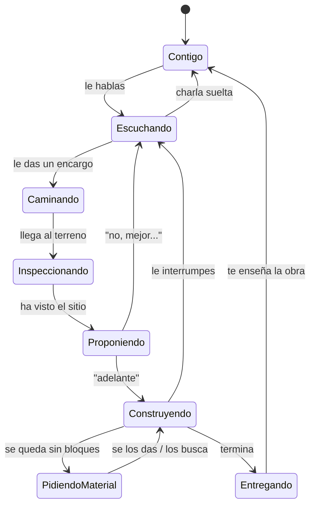

# BetterBuild — El Arquitecto

> Un mod de Minecraft donde la IA **no es un menú: es otro habitante de tu mundo**.
> Una entidad que camina, te escucha, va al sitio que le señalas y lo construye
> con sus propias manos mientras tú lo ves.
> Estado: diseño funcional. Nada implementado todavía.

---

## 1. La idea en una frase

Invocas a un compañero. Le hablas por el chat como le hablarías a otro jugador.
Marcas un terreno con la varita. Le dices *"hazme aquí una taberna medieval"*.
Él va andando hasta allí, lo mira, te propone algo, y si le dices que sí **se pone a
construir bloque a bloque delante de ti**.

Todo lo demás en este documento existe para que esa frase se sienta real.

---

## 2. Qué es exactamente el Arquitecto

Contrato de diseño — estas reglas no se rompen nunca, porque son las que hacen que
parezca un ser vivo y no una interfaz disfrazada:

| Regla | Por qué |
|---|---|
| **Es una entidad física con colisión** | Le puedes cortar el paso, empujar, seguir. No es un holograma |
| **Camina, no se teletransporta** | Si le mandas construir a 200 bloques, tarda en llegar. Puedes ir con él |
| **No atraviesa paredes ni vuela** (salvo en creativo) | Sube por escaleras, salta, rodea obstáculos. Si no puede llegar, te lo dice |
| **Tiene inventario visible** | Lo que construye sale de bloques que lleva encima. Puedes darle y quitarle cosas |
| **Coloca los bloques uno a uno, con animación de brazo** | La obra se ve crecer. Nunca aparece nada de golpe |
| **Puede ser interrumpido en cualquier momento** | Le hablas mientras trabaja y para a escucharte |
| **Persiste** | Se queda en el mundo cuando te desconectas. Sigue ahí mañana, y se acuerda de ti |
| **Es mortal (opcional)** | Un creeper le puede matar. Suelta su inventario. Se le puede revivir |

Aparece en la lista del `Tab` como un jugador más, con su nombre.

---

## 3. Cómo lo consigues

Un solo objeto: el **Plano de Invocación** (crafteable con papel, lapislázuli y una
esmeralda; en creativo está en la pestaña del mod).

1. Lo colocas en el suelo como un item frame.
2. Se dibuja durante 3 segundos y **el Arquitecto sale del plano**.
3. Primera frase suya en el chat:

```
<Arquitecto> Hola. Soy tu arquitecto. Enséñame dónde quieres construir
             y dime qué imaginas.
```

4. Le pones nombre y skin si quieres: `/bb nombre Vera`.

Desde ese momento te sigue a una distancia cómoda, o se queda quieto si le dices
*"espera aquí"*.

---

## 4. El ciclo de trabajo



Cinco fases visibles, todas ocurriendo **en el mundo**, ninguna en una pantalla.

---

## 5. El encargo

### 5.1 La varita

La **Varita de Obra** sirve para señalar, no para construir.

- Click izquierdo / derecho = las dos esquinas del terreno.
- Aparecen **estacas y cuerda** en el suelo (bloques de marcado reales, visibles para
  todos) delimitando el área. No es una caja abstracta de colores: es una parcela.
- El Arquitecto **ve las estacas**. Si estás cerca, comenta al momento:

```
<Arquitecto> 24 por 30, terreno en cuesta y con un río en la esquina norte.
             Se puede hacer algo bonito ahí. ¿Qué tienes en mente?
```

- Sin varita también vale: le apuntas con el cursor a un sitio y dices *"aquí"*. 
  O *"detrás de mi casa"*, *"en esa colina"* — él busca lo que le describes y va a
  plantarse encima para confirmar: *"¿esta colina?"*

### 5.2 Hablarle

No hay campo de texto ni formulario. Es el chat del juego:

```
<Tú>         hazme aquí una taberna medieval de dos plantas
<Arquitecto> Con establo, ¿o solo la taberna?
<Tú>         con establo
<Arquitecto> Voy para allá. Dame un momento para verlo bien.
```

Cosas que entiende y que un menú no permitiría:

- **Referencias a tu mundo**: *"como la casa que hay junto al lago pero más grande"*.
  Va, la mira, y copia la paleta y las proporciones.
- **Referencias a él mismo**: *"como la última, pero de piedra"*.
- **Ambigüedad**: si no sabe algo, **pregunta** en vez de inventar.
- **Charla que no es un encargo**: *"¿qué opinas de mi base?"* → responde, no construye.

### 5.3 Que lo vea con sus ojos

Al llegar, no empieza. **Inspecciona**: da una vuelta al perímetro, sube al punto más
alto, se asoma al agua. Tarda unos segundos y es visible. Luego habla:

```
<Arquitecto> Hay 6 bloques de desnivel de este a oeste. Puedo aterrazarlo
             o levantar la taberna sobre pilotes en el lado bajo.
             Los pilotes quedan mejor con el río al lado.
<Tú>         pilotes
```

Esta fase es la que hace que sus propuestas encajen con el terreno de verdad.

---

## 6. La propuesta

No abre un menú. **Planta la maqueta en el suelo**: replantea el contorno del edificio
con marcas y levanta una silueta traslúcida encima de las estacas, a tamaño real.
Puedes entrar dentro y recorrerla.

Se queda a tu lado esperando, y responde a lo que le digas mirándola:

> `sube el tejado`
> `la puerta que dé al río`
> `quítale el balcón`
> `enséñame otra idea`

Cada corrección **cambia la silueta en el sitio**, delante de ti, en un segundo. Cuando
te gusta:

```
<Tú>         adelante
<Arquitecto> Voy. Me faltan unos 200 bloques de tablón de abeto,
             ¿te los pido o los busco yo?
```

---

## 7. La obra

Aquí es donde el mod se gana el nombre.

- Se sube a la obra, **construye por capas**, de abajo arriba.
- Cada bloque es una colocación real: animación de brazo, sonido, partículas.
- **Se pone andamios** para llegar alto y los quita al terminar.
- Va y viene a los cofres a por material.
- Se aparta si te pones en medio. No te encierra dentro de un muro.
- De noche **pone antorchas** para seguir trabajando, o para de trabajar si se lo pides.

Velocidad configurable: `realista` (satisfactorio de ver, minutos), `rápido`
(por defecto, ~30 s), `instantáneo` (creativo).

Mientras trabaja puedes hablarle. Para, se gira hacia ti y escucha:

```
<Tú>         para
<Arquitecto> Paro.
<Tú>         ese tejado es demasiado oscuro
<Arquitecto> ¿Pizarra clara o teja de barro?
<Tú>         barro
<Arquitecto> Deshago las dos hileras que llevaba y sigo.
```

Deshace lo que ya había puesto de esa parte. No hay que empezar de cero.

---

## 8. Materiales

Es un habitante del mundo, así que los bloques tienen que salir de algún sitio.

| Situación | Qué hace |
|---|---|
| Tiene el material | Construye |
| Le falta | Te lo pide por el chat, con la cantidad exacta |
| Le dices *"búscalo tú"* | **Va a talar árboles, picar piedra o excavar arena** y vuelve. Tarda de verdad |
| Hay cofres cerca marcados como suyos | Se sirve solo |
| Le das un cofre entero | *"Con esto tengo para el tejado y me sobra"* |
| Modo creativo | Material infinito, se salta todo esto |

Le puedes abrir el inventario con click derecho y ver qué lleva.

---

## 9. Cómo sabes qué está pensando

Sin abrir nada, solo mirándolo:

| Estado | Qué ves |
|---|---|
| Esperando | Quieto a tu lado, mirando a donde tú miras |
| Escuchando | Se gira hacia ti, burbuja de diálogo |
| Pensando | Partículas de encantamiento sobre la cabeza, se queda parado |
| Caminando a la obra | Va andando, con el camino visible si quieres |
| Inspeccionando | Da vueltas, se agacha, mira arriba |
| Construyendo | Coloca bloques, brazo animado, sonido de bloque |
| Buscando material | Talando o picando en el bosque |
| Bloqueado | Se para, partículas rojas, **te dice el motivo** |

Y todo lo que dice sale por el chat con su nombre, como cualquier jugador.

---

## 10. Cuando las cosas se tuercen

Es un mundo de Minecraft, así que pasan cosas:

| Situación | Comportamiento |
|---|---|
| **Se hace de noche** | Coloca antorchas y sigue; si hay hostiles cerca, se refugia y avisa |
| **Le ataca un creeper** | Huye hacia ti. No pelea (salvo que le des un arma) |
| **Muere** | Suelta su inventario y su plano. Recoges el plano y lo revives donde quieras. **No pierde la memoria** |
| **No puede llegar al sitio** | *"No hay forma de bajar ahí sin caerme. ¿Te importa si hago escaleras?"* |
| **Se queda atascado** | Se destraba solo a los 10 s; si no, te llama |
| **Te vas lejos** | Sigue trabajando. Al volver: *"Terminé la taberna. Ven a verla"* |
| **Te desconectas** | Se queda donde estaba. Al entrar te resume qué hizo |
| **No hay conexión con la IA** | Sigue siendo una entidad: te sigue, carga cosas, y construye plantillas conocidas. Te dice que ahora no puede diseñar cosas nuevas |

---

## 11. Que se acuerde de las cosas

Esto es lo que lo separa de un mob genérico. El Arquitecto **recuerda**:

- Todo lo que ha construido y dónde (`/bb obras` lista sus trabajos y te lleva a ellos).
- Tu estilo: si tres veces le has pedido piedra oscura, la propone por defecto.
- Correcciones tuyas: si le dijiste que los tejados los quieres más inclinados, lo aplica
  sin que se lo repitas.
- Vuestras conversaciones recientes, para que *"como la de antes"* signifique algo.

```
<Tú>         me acuerdo que hiciste un puente por aquí
<Arquitecto> El de la garganta, a unos 300 bloques al sur. ¿Vamos?
```

---

## 12. En un servidor con amigos

- Es **un jugador más en el Tab**. Todos lo ven, todos lo oyen.
- Le habla quien quiera; atiende encargos **por turnos** y lo dice:
  *"Termino lo de Ana y voy con lo tuyo"*.
- Respeta claims y regiones protegidas: se niega a construir en terreno ajeno.
- El operador controla quién puede darle órdenes y cuántos encargos por día.
- Puede haber **varios arquitectos**, cada uno con su nombre, trabajando en sitios
  distintos.

---

## 13. Cómo funciona por dentro (resumen)

Un LLM no sabe colocar bloques uno a uno: se pierde en la geometría y salen
estructuras flotantes e incoherentes. Así que el reparto es:

```
lo que le dices → el Arquitecto genera un PLANO declarativo
                  (muro, tejado a dos aguas, arco, ventana, pilote…)
                → el mod compila ese plano a bloques con reglas fijas
                → valida que se sostiene y es accesible
                → el Arquitecto ejecuta esa lista, bloque a bloque, andando
```

La IA **diseña y conversa**. El mod **construye**. Por eso *"sube el tejado"* es
instantáneo y barato: cambia un número del plano, no vuelve a preguntar a la IA.

Y por eso el Arquitecto puede caminar hasta la obra mientras tanto: para cuando llega,
el plano ya está listo. **El tiempo de la IA se esconde dentro del tiempo del
personaje.** Nunca ves una barra de carga.

---

## 14. Por dónde empezar

1. **MVP** — la entidad existe: se invoca, te sigue, le hablas por chat, marcas con la
   varita, camina hasta allí y construye una casa sencilla bloque a bloque. `/bb undo`.
2. **v0.2** — inspección del terreno, propuesta con maqueta a tamaño real, correcciones
   habladas.
3. **v0.3** — inventario y materiales de verdad: te los pide, o va a buscarlos.
4. **v0.4** — memoria, interrupciones a mitad de obra, andamios, noche y peligros.
5. **v0.5** — multijugador, turnos, permisos, varios arquitectos.
6. **v1.0** — encargos grandes: aldeas, ampliar tu base respetando su estilo, interiores.

El orden importa en un punto: **lo primero es que la entidad se sienta viva**, aunque
solo sepa construir una cabaña. Un arquitecto que diseña maravillas pero se teletransporta
y hace aparecer los bloques de golpe es un menú con patas, y eso es justo lo que este mod
no quiere ser.
